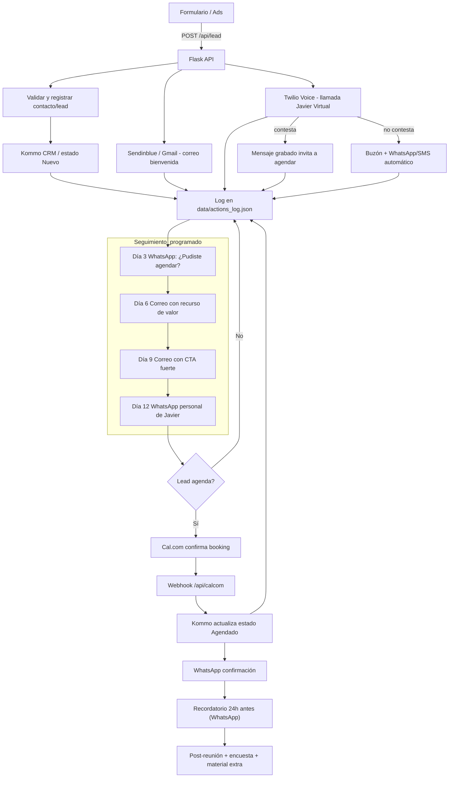

# Automatización de Leads (PAUTA)

Backend Flask que recibe leads, los registra en Kommo CRM y dispara acciones automáticas de correo, llamada y WhatsApp/SMS usando Sendinblue y Twilio. También procesa el webhook de Cal.com para actualizar el estado del lead a "Agendado".

## Requisitos

- Python 3.11+
- Cuenta en Kommo CRM con API v4 habilitada
- Cuenta Sendinblue (o Brevo) para SMTP transactional
- Cuenta Twilio con Voice + Messaging habilitado

## Instalación

1. Clona el repositorio y entra a la carpeta del proyecto.
2. Crea tu entorno virtual y activa:
   ```bash
   python -m venv .venv
   source .venv/bin/activate
   ```
3. Instala dependencias:
   ```bash
   pip install -r requirements.txt
   ```
4. Copia `.env.example` a `.env` y completa todas las llaves:
   ```bash
   cp .env.example .env
   ```
5. Arranca el servidor Flask:
   ```bash
   flask --app app run --debug
   ```

## Variables de entorno clave

| Variable | Descripción |
| --- | --- |
| `KOMMO_BASE_URL` | URL base de tu cuenta Kommo (https://dominio.kommo.com) |
| `KOMMO_ACCESS_TOKEN` | Token OAuth de Kommo (bearer) |
| `KOMMO_PIPELINE_ID` | Pipeline donde se crean los leads |
| `KOMMO_STATUS_ID_INICIAL` | Status inicial del pipeline |
| `KOMMO_STATUS_ID_AGENDADO` | Status "Agendado" para Cal.com |
| `KOMMO_FIELD_ID_EMPRESA` | (Opcional) ID del custom field \"Empresa\" en leads |
| `KOMMO_FIELD_ID_SERVICIO` | (Opcional) ID del custom field \"Servicio\" en leads |
| `KOMMO_FIELD_ID_FUENTE` | (Opcional) ID del custom field \"Fuente\" en leads |
| `SENDINBLUE_API_KEY` | API key SMTP de Sendinblue |
| `SENDINBLUE_SENDER_EMAIL` | Email remitente validado |
| `TWILIO_ACCOUNT_SID` / `TWILIO_AUTH_TOKEN` | Credenciales Twilio |
| `TWILIO_CALLER_ID` | Número verificado para llamadas |
| `TWILIO_WHATSAPP_SENDER` | Número aprobado para WhatsApp |
| `TWILIO_SMS_SENDER` | Número SMS para fallback |
| `BOOKING_URL` | URL de agendado (Cal.com) |

## Endpoints

### POST `/api/lead`
Recibe el lead y dispara todo el flujo.

```json
{
  "nombre": "Ana",
  "email": "ana@empresa.com",
  "telefono": "8112345678",
  "empresa": "Empresa Demo",
  "servicio": "Implementación IA",
  "fuente": "LinkedIn Ads"
}
```

Respuesta exitosa: `{ "ok": true, "lead_id": 123456 }`.

### POST `/api/calcom`
Webhook de Cal.com (`BOOKING_CREATED`). Debe incluir `lead_id` en `payload.metadata` o en el cuerpo raíz para actualizar el status en Kommo.

```json
{
  "event": "BOOKING_CREATED",
  "payload": {
    "metadata": {
      "lead_id": 123456
    }
  }
}
```

## Ejemplos de prueba

### cURL lead
```bash
curl -X POST http://localhost:5000/api/lead \
  -H "Content-Type: application/json" \
  -d '{
    "nombre": "Ana Test",
    "email": "ana.test@example.com",
    "telefono": "8112345678",
    "empresa": "Demo SA",
    "servicio": "Consultoría IA",
    "fuente": "Landing 1"
  }'
```

### cURL webhook Cal.com
```bash
curl -X POST http://localhost:5000/api/calcom \
  -H "Content-Type: application/json" \
  -d '{
    "event": "BOOKING_CREATED",
    "payload": {
      "metadata": {
        "lead_id": 123456
      }
    }
  }'
```

### Colección Postman
Importa los dos ejemplos anteriores como requests individuales cambiando los valores por tus propios datos. Asegúrate de tener el servidor corriendo y las variables de entorno configuradas.

## Registro y monitoreo

Cada acción (Kommo, correo, llamada, WhatsApp/SMS) se imprime en consola y se guarda en `data/actions_log.json`. Puedes revisar ese archivo para auditar el flujo completo.

## Diagrama de flujo (Mermaid)



## Estructura

```
.
├── app.py
├── routes/
│   └── leads.py
├── services/
│   ├── email.py
│   ├── kommo.py
│   ├── logger.py
│   └── twilio.py
├── data/actions_log.json
├── requirements.txt
└── .env.example
```

## Próximos pasos sugeridos
- Asegurar un endpoint público (Gunicorn + reverse proxy) o desplegar en un servicio como Render / Railway.
- Configurar colas (RQ, Celery) si el volumen de leads aumenta.
- Añadir verificación de firma para el webhook de Cal.com (`CALCOM_WEBHOOK_SECRET`).
# automatizacion_pauta
